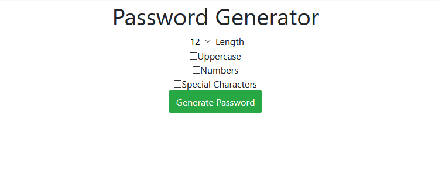

# django_projects
<h3>This Repository Consists Of 3 Different Projects Based on Django.</h3>
<ol>
  <li>
      <h4>Password Generator</h4>
      
In this project, First, I've created two pages. In which, one page will take input and then another page will display processed data. 
      Here, I've been dealing with only two files e.g: urls.py and views.py which need not required any database for the project

       
       
  </li>
</ol>
